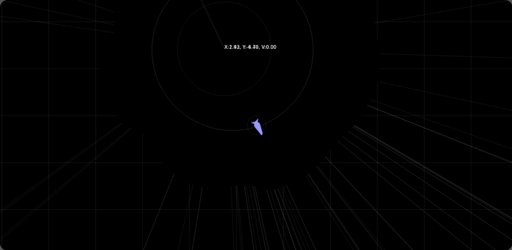

# Spaceship

2d space sandbox multiplayer html5 game

[Live Demo](https://repcomm.github.io/spaceship)

Planned features:
- Basic modular ship/station building
- Basic physics to play with
- Deformable planets
- Basic collision
- Basic multiplayer over LAN (WebRTC)
- Automated bots using local script modules
- Reprogrammable inputting (including for scripts)
- Large scale space
- Vector based rendering